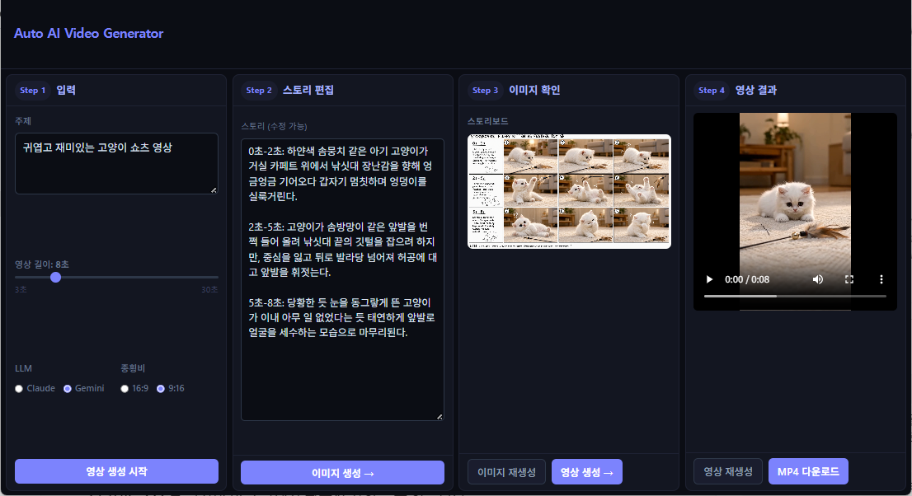

# Auto AI Video Generator

> 한국어 문서: [README-ko.md](README-ko.md)

An AI-powered web app that turns a text topic into a fully assembled video — automatically. Enter a topic and duration, then watch the pipeline generate a story, storyboard image, and final video clip with no manual steps in between.

Just enter a topic, duration, and aspect ratio — the 4-step pipeline (story → storyboard image → video clip → final MP4) runs automatically. (requires fal.ai and Claude or Gemini API key)

- **Agent-first CLI base** — built on fal.ai genmedia, an agent-first CLI that handles all AI model calls for image and video generation
- **Auto Story Generation** — LLM automatically generates a timestamped scene-by-scene story script; users can review and edit before proceeding. Supports both Claude and Gemini
- **Auto Storyboard Generation** — the story script is sent to genmedia (GPT-Image-2) to generate a single storyboard image visualizing the full video sequence
- **Auto Video Generation** — the storyboard image is uploaded to fal.ai and animated into a video clip by genmedia (Seedance 2.0); async polling handles the generation job until complete

## Result



## How It Works

```
[Input: topic + duration]
        ↓
Step 1  LLM (Claude / Gemini) — generates a scene-by-scene story with timestamps
        ↓
Step 2  Image Gen (GPT-Image-2 via fal.ai) — renders a single storyboard image
        ↓
Step 3  Video Gen (SeedanCe 2.0 via fal.ai) — animates the storyboard into a video clip
        ↓
Step 4  Final MP4 ready to download
```

## Tech Stack

| Layer | Technology |
|---|---|
| Frontend | React 19 + TypeScript + Vite |
| Backend | Python FastAPI + uvicorn |
| LLM | Claude (claude-sonnet-4-6) or Gemini (gemini-3.1-flash-lite) |
| Image Generation | `openai/gpt-image-2` via genmedia-cli (fal.ai) |
| Video Generation | `bytedance/seedance-2.0/reference-to-video` via genmedia-cli (fal.ai) |

## Prerequisites

- Python 3.11+
- Node.js 18+
- [ffmpeg](https://ffmpeg.org/download.html) — must be in PATH
- [genmedia-cli](https://genmedia.sh) — fal.ai CLI tool

## Installation

### 1. Clone the repository

```bash
git clone https://github.com/wonwizard/AutoAIVideoGenerator.git
cd AutoAIVideoGenerator
```

### 2. Install genmedia-cli

```bash
# macOS / Linux
curl https://genmedia.sh/install -fsS | bash

# Windows (PowerShell)
irm https://genmedia.sh/install.ps1 | iex
```

Configure with your fal.ai API key:

```bash
genmedia setup --non-interactive --api-key "YOUR_FAL_KEY"
```

### 3. Set up environment variables

```bash
cp env.example .env
```

Edit `.env` and fill in your API keys:

```env
ANTHROPIC_API_KEY=your_anthropic_api_key
FAL_KEY=your_fal_api_key
GEMINI_API_KEY=your_gemini_api_key   # optional, only needed if using Gemini
```

API keys can be obtained from:
- **Anthropic API key** — [console.anthropic.com](https://console.anthropic.com)
- **fal.ai API key** — [fal.ai/dashboard](https://fal.ai/dashboard)
- **Gemini API key** — [aistudio.google.com](https://aistudio.google.com)

### 4. Install dependencies

```bash
# Python
pip install -r requirements.txt

# Frontend
cd frontend && npm install
```

## Running

### Quick start (bash)

```bash
bash start.sh
```

### Manual start

```bash
# Terminal 1 — backend
uvicorn backend.main:app --reload --port 8000

# Terminal 2 — frontend
cd frontend && npm run dev
```

Open **http://localhost:5173** in your browser.

## Usage

1. Enter a topic and choose video duration (3–30 s), LLM, and aspect ratio
2. Click **Start** — the story is generated and displayed for review
3. Edit the story text if needed, then click **Generate Image**
4. Review the storyboard image, then click **Generate Video**
5. Download the final MP4 when ready

